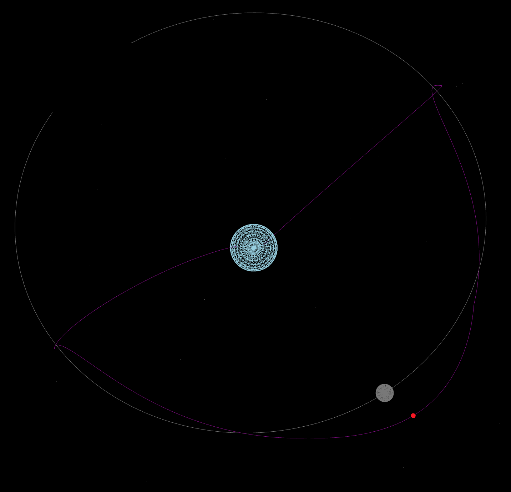

# About

Some scripts to display the current location of Artemis I's Orion spacecraft, using NASA OEM
[data](https://www.nasa.gov/feature/track-nasa-s-artemis-i-mission-in-real-time).

API implemented using SpiceyPy and Flask.  UI implemented in React, based on the 
[React Three Fiber](https://github.com/pmndrs/react-three-fiber) 
[demo](https://codesandbox.io/s/rrppl0y8l4?file=/src/App.js).

# Using

NOTE: the API and UI are built in development mode. 
Exposing the container ports to unprotected environments 
(e.g. the internet, coffee shop wifi, etc...) is strongly discouraged.

1. Run `docker-compose build` to build the API and UI containers
2. Run `docker-compose up` to launch the containers

When launched, the docker-compose project will create an API container running Flask in 
dev mode (port 5000), and a UI container running the React UI in dev mode (port 3000).
